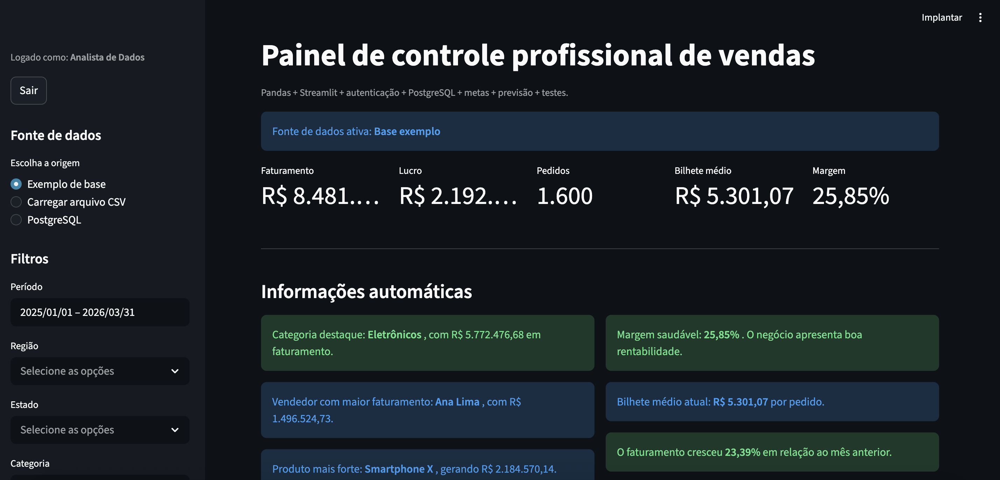
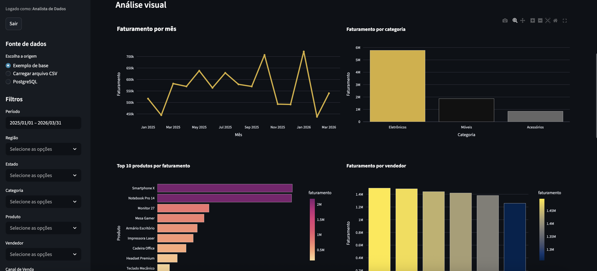
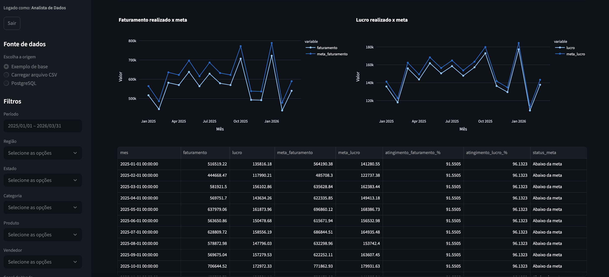

[](https://dashboard-vendas-pro-zaj5qlcnq25abddvpqkcxz.streamlit.app/)

# 📊 Dashboard de Vendas Profissional

Aplicação web desenvolvida com **Python** e **Streamlit** para análise de vendas, monitoramento de indicadores e visualização interativa de dados.

---

## 💼 Sobre o projeto

Este dashboard simula um ambiente real de análise de vendas, permitindo monitorar desempenho comercial, identificar oportunidades e apoiar decisões estratégicas com base em dados.

---

## 🚀 Acesse o projeto

🔗 [Acessar Dashboard Online](https://dashboard-vendas-pro-zaj5qlcnq25abddvpqkcxz.streamlit.app/)

---

## 🖼️ Demonstração

### Visão geral



### Gráficos



### Tabelas analíticas



---

## 📌 Funcionalidades

- 📈 Visualização de KPIs de vendas
- 💰 Análise de faturamento e lucro
- 🧮 Cálculo de ticket médio
- 📊 Gráficos interativos com Plotly
- 🔎 Filtros dinâmicos (período, produto, região, vendedor, etc.)
- 📅 Análise temporal de desempenho
- 🎯 Análise de metas comerciais
- 🔮 Previsão de vendas (forecast)
- 📤 Exportação de dados em CSV
- 🔐 Autenticação com Streamlit Secrets

---

## 🛠️ Tecnologias Utilizadas

- Python
- Streamlit
- Pandas
- Plotly
- Scikit-learn
- SQLAlchemy
- PostgreSQL
- Pytest

---

## 📂 Estrutura do Projeto

```text
Dashboard-Vendas-Pro/
├── app.py
├── requirements.txt
├── README.md
├── .gitignore
├── LICENSE
├── assets/              # Imagens do README
│   ├── dashboard-home.png
│   ├── dashboard-graficos.png
│   └── dashboard-tabelas.png
├── data/
├── sql/
├── src/
└── tests/               # Testes automatizados
